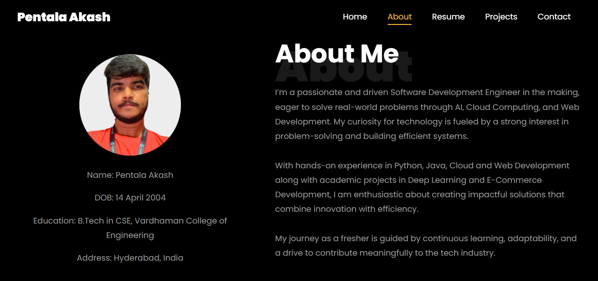
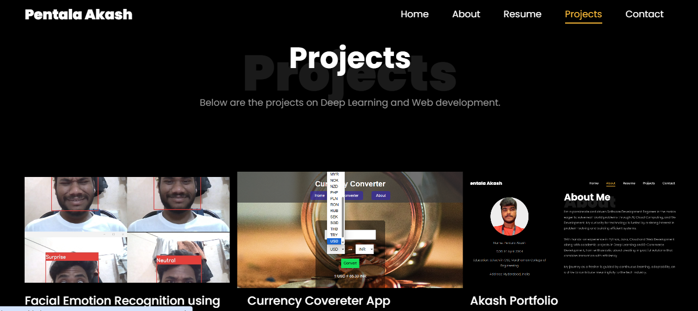

# Pentala Akash Portfolio

Welcome to my personal portfolio! This website showcases my **skills, projects, and experience** as a Computer Science and Engineering student with a focus on **AI, Data Science, Cloud Computing, and Web Development**.

## 🌟 About Me
I am a passionate and driven software enthusiast, eager to solve real-world problems and continuously learn new technologies. This portfolio demonstrates my hands-on experience in Python, Java, Web Development, and Data Analysis.

## 💻 Technologies Used
- **Frontend:** HTML, CSS, JavaScript
- **Animations & Libraries:** Bootstrap, Owl Carousel, AOS
- **Other Tools:** Git, GitHub

## 🏆 Features
- Responsive design optimized for mobile and desktop
- Animated hero section with typing effects
- About section with profile details and skill progress bars
- Projects section with interactive project showcase and GitHub links
- Contact section with email, phone, LinkedIn, and resume download

## 📂 Folder Structure
portfolio/
├── index.html
├── css/
├── js/
├── images/
├── README.md

## 🔗 Live Demo
The portfolio is hosted via GitHub Pages:  
[View Live Portfolio](https://YourUsername.github.io/portfolio/)
# Pentala Akash Portfolio

Welcome to my personal portfolio! This website showcases my **skills, projects, and experience** as a Computer Science and Engineering student with a focus on **AI, Data Science, Cloud Computing, and Web Development**.

## 🌟 About Me
I am a passionate and driven software enthusiast, eager to solve real-world problems and continuously learn new technologies. This portfolio demonstrates my hands-on experience in Python, Java, Web Development, and Data Analysis.

## 💻 Technologies Used
- **Frontend:** HTML, CSS, JavaScript
- **Animations & Libraries:** Bootstrap, Owl Carousel, AOS
- **Other Tools:** Git, GitHub

## 🏆 Features
- Responsive design optimized for mobile and desktop
- Animated hero section with typing effects
- About section with profile details and skill progress bars
- Projects section with interactive project showcase and GitHub links
- Contact section with email, phone, LinkedIn, and resume download

## 📸 Screenshots

### About Me Section

### Projects Section

## 📫 Contact Me
- **Email:** akashpentala104@gmail.com  
- **LinkedIn:** [https://www.linkedin.com/in/akash-pentala-16aa00255/](https://www.linkedin.com/in/akash-pentala-16aa00255/)  
- **GitHub:** [https://github.com/PENTALAAKASH](https://github.com/PENTALAAKASH)

---

**Implementation:**  
This portfolio is built with **HTML, CSS, and JavaScript**, featuring a responsive layout, animated sections, skill bars, and interactive project showcases.

